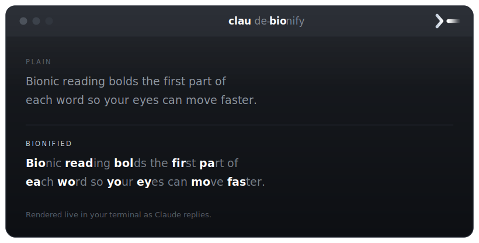
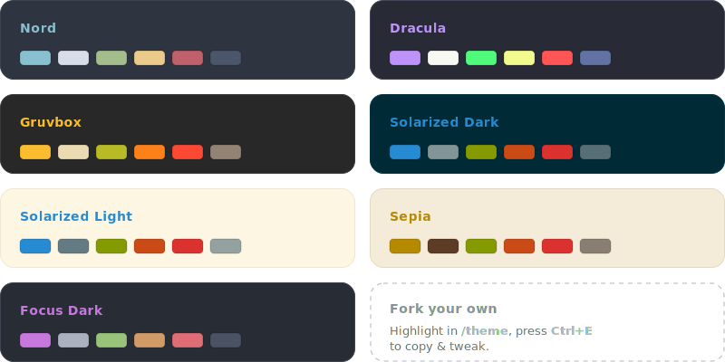

<div align="center">


<h1>claude-bionify</h1>

<p>
  <strong>Bionic reading for Claude Code. Bold the front of every word so your eyes move faster.</strong><br>
  <sub>So <b>Bio</b>nify <b>mak</b>es <b>Cla</b>ude's <b>repl</b>ies <b>eas</b>ier to <b>re</b>ad.</sub>
</p>

[](LICENSE)


[](https://github.com/abullard1/claude-bionify/actions/workflows/ci.yml)
[](https://buymeacoffee.com/samuelbullard)

<br>



</div>

---

```claude-bionify``` bolds the leading part of each word in Claude's streamed replies, giving
your eye a fixation point per word. This is the bionic-reading technique, inspired by the
eye-movement research showing that we read by fixating a single convenient position toward the
start of each word, where its opening letters carry the most information for recognising it
([Rayner, 1979](https://doi.org/10.1068/p080021);
[O'Regan et al., 1984](https://doi.org/10.1037/0096-1523.10.2.250)).

It only changes how text looks on screen. What gets saved to the transcript and what Claude
reads stays the original, unbolded text, which you can reopen any time with the `Ctrl+O`
transcript view.

## Features

- ⚡ **Faster, calmer reading.** Fixation points pull your eye word to word through long answers.
- 🌍 **Any language.** Unicode-aware, so accents and non-Latin scripts bold correctly, not just English.
- 🎚️ **Three boundary modes.** `fraction`, `syllable`, or `log` — see [Configure](#configure).
- 🧩 **Markup-aware.** Code, links, URLs, paths, and acronyms stay intact ([what it touches](#what-it-touches)).
- 🔒 **Private, zero-dependency.** Nothing to install, no network, no telemetry — it runs entirely on your machine.
- 🪶 **Crash-safe.** On any error it falls back to the original text.

## Install

```shell
/plugin marketplace add abullard1/claude-bionify
/plugin install claude-bionify@claude-bionify
```

claude-bionify is active right away. Turn it off or back on any time with `/claude-bionify:off` and
`/claude-bionify:on`, or from `/plugin`.

## Configure

When you enable the plugin, Claude Code prompts for these (all optional):

| Setting | Default | Meaning |
| :------ | :------ | :------ |
| **Bold boundary** | `fraction` | `fraction` bolds by Fixation strength; `syllable` ends each word at its first syllable (e.g. **stri**ng); `log` grows logarithmically so long words are bolded less. |
| **Fixation strength** | `0.5` | Fraction of each word to bold (`0.1`–`0.9`). Higher is bolder. Applies to `fraction` mode only. |
| **Minimum word length** | `4` | Words shorter than this are left unbolded. |
| **Skip acronyms** | `on` | Leave ALL-CAPS acronyms like `API` or `JSON` whole. |
| **Protect URLs, paths, files** | `on` | Don't bold inside URLs, emails, file paths, or filenames. |
| **Skip headings** | `on` | Leave markdown headings (`#` lines) unbolded; they're already prominent. |

## Control it live

Change claude-bionify mid-session without a reload or any config editing. The next reply reflects it right away:

| Command | Does |
| :------ | :--- |
| `/claude-bionify:toggle` | Flip claude-bionify on/off |
| `/claude-bionify:on` · `/claude-bionify:off` | Turn it on or off explicitly |
| `/claude-bionify:set strength 0.7` | Set fixation strength (`0.1`–`0.9`) |
| `/claude-bionify:set boundary syllable` | Switch boundary (`fraction` · `syllable` · `log`) |
| `/claude-bionify:set minlen 5` · `/claude-bionify:set acronyms off` · `/claude-bionify:set urls off` · `/claude-bionify:set headings off` | Tweak the other settings |
| `/claude-bionify:status` | Show the active overrides |
| `/claude-bionify:reset` | Clear overrides, back to your configured defaults |

These write a small override file that the hook reads on every message, so changes take effect immediately and persist until you `reset`.

## Themes

claude-bionify also ships **seven color palettes** for Claude Code's `/theme` picker
(`custom:claude-bionify:<name>`). They retint Claude Code's interface and are
independent of the bolding.

<div align="center">
  
</div>

<details>
<summary><strong>Exact palette values</strong></summary>

| Theme | Base | Text | Accent | Subtle | Success | Warning | Error |
| :---- | :--- | :------- | :------- | :------- | :------- | :------- | :------- |
| Nord | dark | `#D8DEE9` | `#88C0D0` | `#4C566A` | `#A3BE8C` | `#EBCB8B` | `#BF616A` |
| Dracula | dark | `#F8F8F2` | `#BD93F9` | `#6272A4` | `#50FA7B` | `#F1FA8C` | `#FF5555` |
| Gruvbox | dark | `#EBDBB2` | `#FABD2F` | `#928374` | `#B8BB26` | `#FE8019` | `#FB4934` |
| Solarized Dark | dark | `#839496` | `#268BD2` | `#586E75` | `#859900` | `#CB4B16` | `#DC322F` |
| Solarized Light | light | `#657B83` | `#268BD2` | `#93A1A1` | `#859900` | `#CB4B16` | `#DC322F` |
| Sepia | light | `#5C3C24` | `#B58900` | `#8A7E72` | `#859900` | `#CB4B16` | `#DC322F` |
| Focus Dark | dark | `#ABB2BF` | `#C678DD` | `#4B5263` | `#98C379` | `#D19A66` | `#E06C75` |

Plugin themes are read-only. Highlight one in `/theme` and press `Ctrl+E` to copy it
into `~/.claude/themes/` and tweak your own.

</details>

## How it works

```
Claude streams a reply ▸ claude-bionify ▸ bolded text in your terminal
```

As each batch of Claude's reply streams in, claude-bionify bolds it just before it reaches your
screen — so only what you see changes, never the text itself.

## What it touches

- **Bolded:** ordinary prose words.
- **Left alone:** inline `` `code` ``, fenced code blocks,
  markdown link/image targets, URLs, emails, file paths and filenames, ALL-CAPS acronyms,
  and any text Claude already wrapped in `**bold**`.
- **Never touched:** your own input and tool output.

## Requirements

- Claude Code with plugin support
- `python3` on your `PATH`
- A terminal that renders markdown bold (any modern terminal)

## Limitations

- Affects **assistant chat text only**, not tool results or your prompts.
- Text in tables and headings is treated as prose and gets bolded, which is intended.
  Deeply nested or unusual markdown may occasionally mis-bold a word. It is cosmetic only, and
  it never changes the underlying text.
- Right-to-left scripts (Arabic, Hebrew) are not a target; there, syllable mode falls back
  to a length-based bold.
- Each line is processed on its own, so a markdown construct split across a line break
  (rare) may not be detected.

## Development

```shell
# Run against a working copy without installing
claude --plugin-dir ./plugins/claude-bionify

# Validate the manifest and components
claude plugin validate ./plugins/claude-bionify --strict

# Run the tests (project-local virtualenv, nothing system-wide)
python3 -m venv .venv && .venv/bin/pip install pytest
.venv/bin/python -m pytest tests/
```

Set `CLAUDE_BIONIFY_DEBUG=1` to make the hook re-raise on error instead of silently falling back,
so failures surface while you iterate.

## Repository layout

```
claude-bionify/
├── .claude-plugin/
│   └── marketplace.json      # marketplace catalog
├── assets/                   # logo, demo, theme gallery (SVG) + generate_themes.py
├── plugins/claude-bionify/          # the plugin
│   ├── .claude-plugin/plugin.json
│   ├── hooks/hooks.json      # MessageDisplay -> bionify.py
│   ├── commands/             # /claude-bionify:on, off, toggle, set, status, reset
│   ├── skills/               # model-invoked control/config skill
│   ├── scripts/
│   │   ├── core.py           # functional core: pure formatting + settings (no I/O)
│   │   ├── overrides.py      # runtime-override persistence (shared contract)
│   │   ├── bionify.py        # the MessageDisplay hook shell (entrypoint)
│   │   └── control.py        # the /claude-bionify control CLI
│   ├── themes/               # 7 color themes for /theme (experimental component)
│   └── README.md
└── tests/test_bionify.py
```

## Contributing

Issues and pull requests are welcome. Run `.venv/bin/python -m pytest tests/` and
`claude plugin validate ./plugins/claude-bionify --strict` before opening a PR.

## Author

<table>
  <tr>
    <td>
      
    </td>
    <td>
      <strong>Samuel Ruairí Bullard</strong><br>
      Human-Centred AI @ University of Regensburg · Regensburg, Germany<br>
      <a href="https://github.com/abullard1">GitHub&nbsp;@abullard1</a> ·
      <a href="https://sams3dlibrary.com/">sams3dlibrary.com</a> ·
      <a href="https://x.com/samudschigo">X&nbsp;@samudschigo</a>
    </td>
  </tr>
</table>

Built by Samuel Ruairí Bullard. If claude-bionify makes your reading easier, a ⭐ on the
[repo](https://github.com/abullard1/claude-bionify) is hugely appreciated.

## License

[MIT](LICENSE) © 2026 [Samuel Ruairí Bullard](https://github.com/abullard1).

## Star History
<a href="https://www.star-history.com/?repos=abullard1%2Fclaude-bionify&type=date&legend=top-left">
 <picture>
   <source media="(prefers-color-scheme: dark)" srcset="https://api.star-history.com/chart?repos=abullard1/claude-bionify&type=date&theme=dark&legend=top-left&sealed_token=kIZ0D_7-6Pa8BK1jH0HjWmuz3fgXQu_MxoGN2fb2Xl7Zx5xPyHhpb2qJexL9w3hQQ9lWsC0lFZFqcXwMKe1aE0s8_PFRjbZ5ZWdKKIiufkZCq0RJuqWjSY9QuKxg4oVqDtoTNCcM0QPAnCew2WoiLDjgrbgAIKjX0O4tNiD-jYcbqa1IdgDdIPPSMe7Y" />
   <source media="(prefers-color-scheme: light)" srcset="https://api.star-history.com/chart?repos=abullard1/claude-bionify&type=date&legend=top-left&sealed_token=kIZ0D_7-6Pa8BK1jH0HjWmuz3fgXQu_MxoGN2fb2Xl7Zx5xPyHhpb2qJexL9w3hQQ9lWsC0lFZFqcXwMKe1aE0s8_PFRjbZ5ZWdKKIiufkZCq0RJuqWjSY9QuKxg4oVqDtoTNCcM0QPAnCew2WoiLDjgrbgAIKjX0O4tNiD-jYcbqa1IdgDdIPPSMe7Y" />
   
 </picture>
</a>
